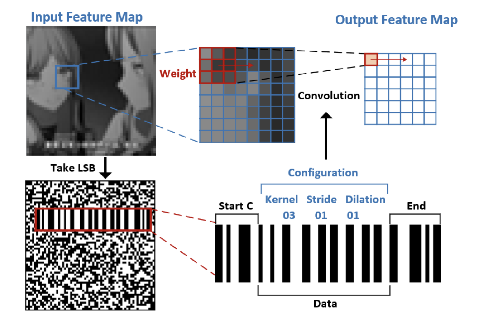

# HW3 — 2D Convolution Accelerator (RTL → Synthesis)

A two-stage image processing accelerator: **barcode region detection** followed by **2D convolution** producing four parallel output streams. The first project taken through **logic synthesis** with full SDC constraints and timing/area sign-off on a TSMC 0.13 µm library.

<p align="center">
  
  <br/>
  <sub><em>Input image alongside the four parallel convolved output streams produced by the accelerator.</em></sub>
</p>

## What This Demonstrates

- **Hierarchical RTL** — top-level controller (`core.sv`) orchestrates two specialized engines (`Barcode.sv`, `ConvCore.sv`) sharing a single SRAM
- **SRAM integration** — instantiates a `4096 × 8` single-port SRAM macro with `.lib`/`.db` from the foundry; netlist arbitration between image-load, barcode-detect, weight-load and convolution phases
- **Streaming datapath** — convolution kernel sliding window with on-the-fly address generation, four concurrent 8-bit output channels with valid handshakes
- **Synthesis-ready RTL** — explicit reset, no inferred latches, lint-clean (SpyGlass)
- **First exposure to the synthesis flow** — writing `syn.tcl`, defining `core_dc.sdc`, reading reports, iterating on timing

## Architecture

```
                       ┌───────────────────────────────────────────────────┐
   i_in_data[31:0] ──▶ │                       core                        │
   i_in_valid     ──▶ │                                                   │
                      │  FSM: IDLE → READ_IMG → BARCODE → READ_WEIGHT     │
                      │            → CONV → DONE                          │
                      │                                                    │
                      │  ┌──────────┐    ┌──────────┐    ┌───────────────┐│
                      │  │ Image    │    │ Barcode  │    │ ConvCore       ││
                      │  │ Loader   │───▶│ Detector │───▶│  ─ kernel ROM  ││
                      │  │          │    │  (start, │    │  ─ window MAC  ││
                      │  └──────────┘    │   end pt)│    │  ─ output gen  ││
                      │       │          └──────────┘    └────────┬───────┘│
                      │       ▼                                   │        │
                      │  ┌──────────────────────────────────────┐ │        │
                      │  │      sram_4096x8 (image + weight)    │◀┘        │
                      │  └──────────────────────────────────────┘          │
                      │                                                    │
                      │  4× {o_out_data, o_out_addr, o_out_valid}, o_exe_finish │
                      └───────────────────────────────────────────────────┘
```

## Synthesis Results

**Synopsys Design Compiler U-2022.12 · TSMC 0.13 µm slow corner**

| Constraint | Value |
|------------|-------|
| Clock period | **6.0 ns** (`create_clock -period 6 [get_ports i_clk]`) |
| Input/output delay | 50% of clock period |
| Wire load model | `tsmc13_wl10` |

| Area Breakdown | µm² |
|---------------|-----|
| Combinational cells | 34,591 |
| Buf/Inv | 1,168 |
| Sequential cells | 11,810 |
| Macro (SRAM) | 131,907 |
| **Total cell area** | **178,309** |

| Cell Stats | Count |
|-----------|-------|
| Total cells | 2,972 |
| Combinational | 2,570 |
| Sequential | 343 |
| Macros | 1 (SRAM 4096×8) |
| Buf/Inv | 285 |

Timing closed at the target clock period (positive slack on critical path: weight register → ConvCore output register).

## Verification

| Stage | Tool | Status |
|-------|------|--------|
| RTL lint | SpyGlass | Clean (`01_RTL/spyglass_violations.rpt`) |
| RTL functional sim | Synopsys VCS + Verdi | All 5 image patterns pass |
| Synthesis | Synopsys DC | Timing and area met |
| Gate-level sim | VCS + back-annotated SDF | Functional equivalence verified |

## Directory Layout

```
HW3_Convolution_Engine/
├── 01_RTL/
│   ├── core.sv             ← top-level controller
│   ├── ConvCore.sv         ← convolution engine
│   ├── Barcode.sv          ← barcode detector
│   ├── lint.tcl            ← SpyGlass lint script
│   └── spyglass_violations.rpt
├── 02_SYN/
│   ├── syn.tcl             ← Synopsys DC synthesis script
│   ├── core_dc.sdc         ← timing constraints
│   ├── Netlist/            ← gate-level netlist + SDF
│   └── Report/             ← area, timing, design check reports
├── 03_GATE/                ← gate-level simulation
├── sram_256x8/  sram_512x8/  sram_4096x8/   ← SRAM .v / .lib / .db / datasheet
├── report.txt              ← summary of clock period, area, sim time
└── 1141_hw3_v4.pdf         ← assignment specification
```
